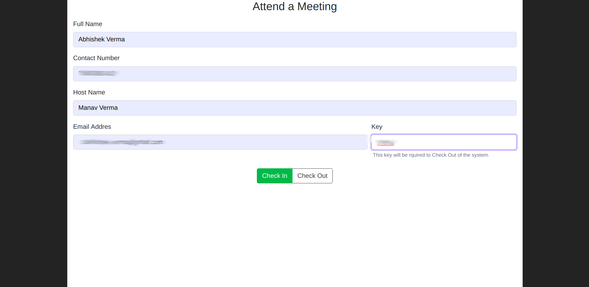
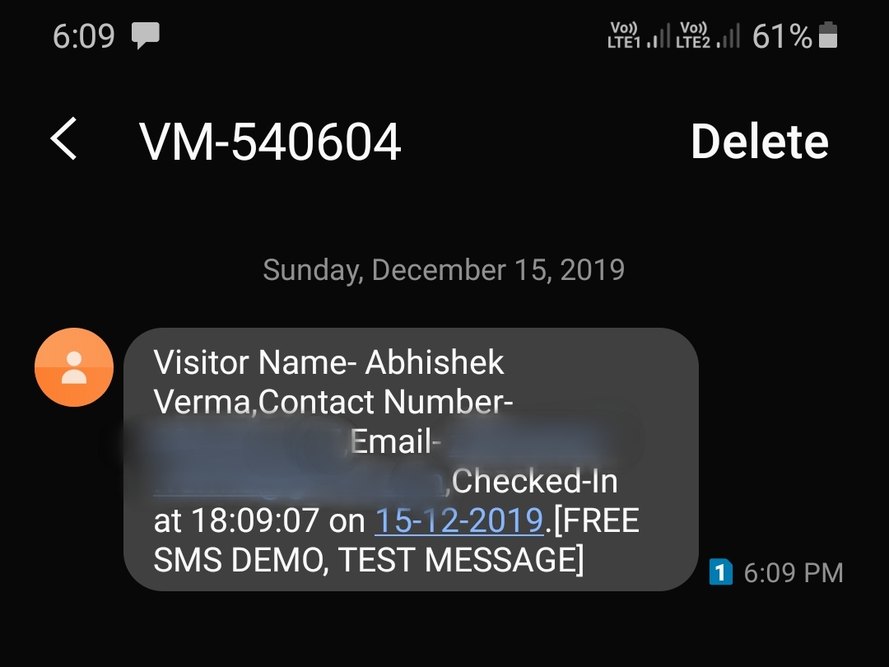

<h1 align="center">Bifrost</h1>
<h4 align="center">Entry Management Software</h4>
<p>

  
  <a href="https://github.com/vmanav/Bifrost#readme" target="_blank">
    
  </a>
  <a href="https://github.com/vmanav/Bifrost/graphs/commit-activity" target="_blank">
    
  </a>
  <a href="https://github.com/vmanav/Bifrost/blob/master/LICENSE" target="_blank">
    
  </a>
</p>


### 🏠 [Homepage](https://github.com/vmanav/Bifrost#readme)

## About

Bifrost is a Node.js based Entry Management Software to manage meetings between Hosts and Clients conveniently. The functionalities supported are stated below :

* Host Register/ Deregister.
* Visitor Check-In/ Check-Out.
* Visitor Check-In Details mail and sms to respective host.
* Visit Details mail to visitor on Check-Out.

## Description of the Problem Statement

We need an application, which can capture the Name, email address, phone no of the visitor and same information also needs to be captured for the host on the front end.

At the back end, once the user enters the information in the form, the backend should store all of the information with time stamp of the entry. This should trigger an email and an SMS to the host informing him of the details of the visitor.

There should also be a provision of the checkout time which the guest can provide once he leaves. This should trigger an email to the guest with the complete form which should include:

1. Name
1. Phone
1. Check-in time
1. Check-out time
1. Host name
1. Address visited.

## Intended Workflow

The idea is to develop a minimalistic application without any complex Visitor LogIn/Out mechanism. I have used a combination of _**checkOutTime**_, a CheckOut Timestamp and _**checkedIn**_ flag, a Boolean flag to keep record whether a visitor is checked in or not for the Management of the Login Session of the user.

Also with this logic even when a visitor logs out of the system its entry will not be removed from the database and will serve as a log in the data base.

## Usage

### Prerequisites 

* Node.js installed
* Mongodb installed
* An account on Nexmo for keys and tokens to facilitate SMS functionality

### Installing Dependencies

To install Dependencies run

```sh
npm i
```

### Settings up Environment variables 

To setup the environment variables you have to create a .env file, add your Gmail and Nexmo Credentials to it in order to facilitate successful Email and SMS transfers respectively, as shown below

```sh
# nodemailer credetials

NODEMAILER_EMAIL=
NODEMAILER_PASS=

# nexmo credentials
NEXMO_API_KEY=
NEXMO_API_SECRET=
```


### Commands

After you have succefullyy set up the environment variables, to start the application you need to run

```sh
npm start
```

---

### <pre>Note : A Nexmo Free Account only supports sending SMS to verified mobile numbers, so the host number must be verified inorder to successfully recieve an SMS.</pre>


## Gallery

Snapshots of project.

Landing Page


Host Registration Page


Visitor Registration Page


Mail sent to Host when a Visitor Checks-in


SMS sent to Host when a Visitor Checks-in


Mail sent to Visitor on Checks-out


## Author

👤 **Manav Verma**

* Github: [@vmanav](https://github.com/vmanav)

## 🤝 Contributing

Contributions, issues and feature requests are welcome!<br />Feel free to check [issues page](https://github.com/vmanav/Bifrost/issues).

## Show your support

Give a ⭐️ if this project helped you!

## 📝 License

Copyright © 2019 [Manav Verma](https://github.com/vmanav).<br />
This project is [GNU](https://github.com/vmanav/Bifrost/blob/master/LICENSE) licensed.

***
